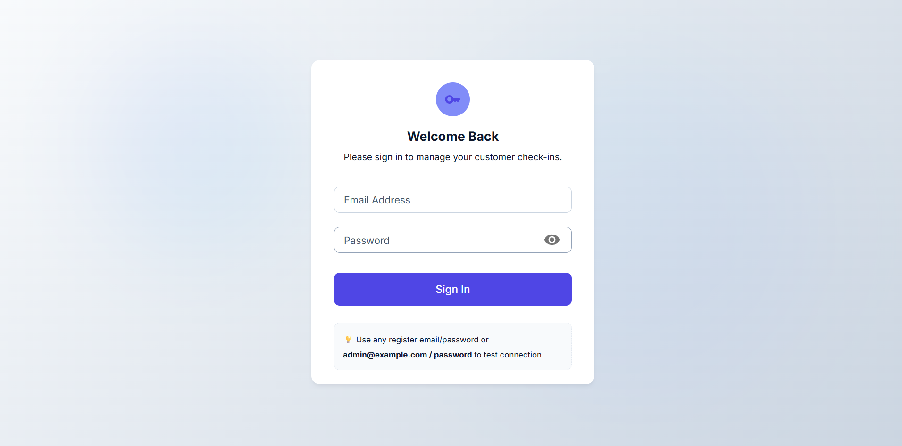
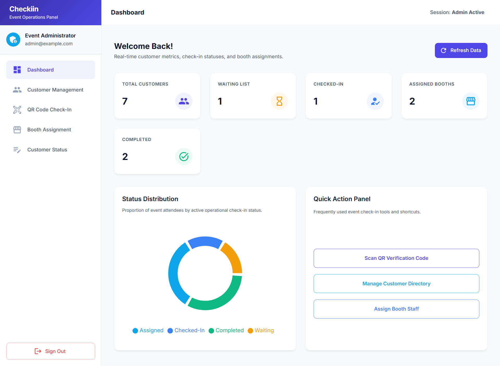
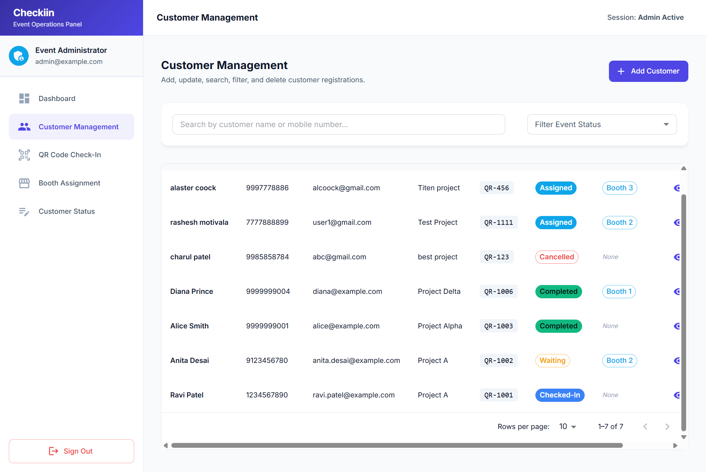
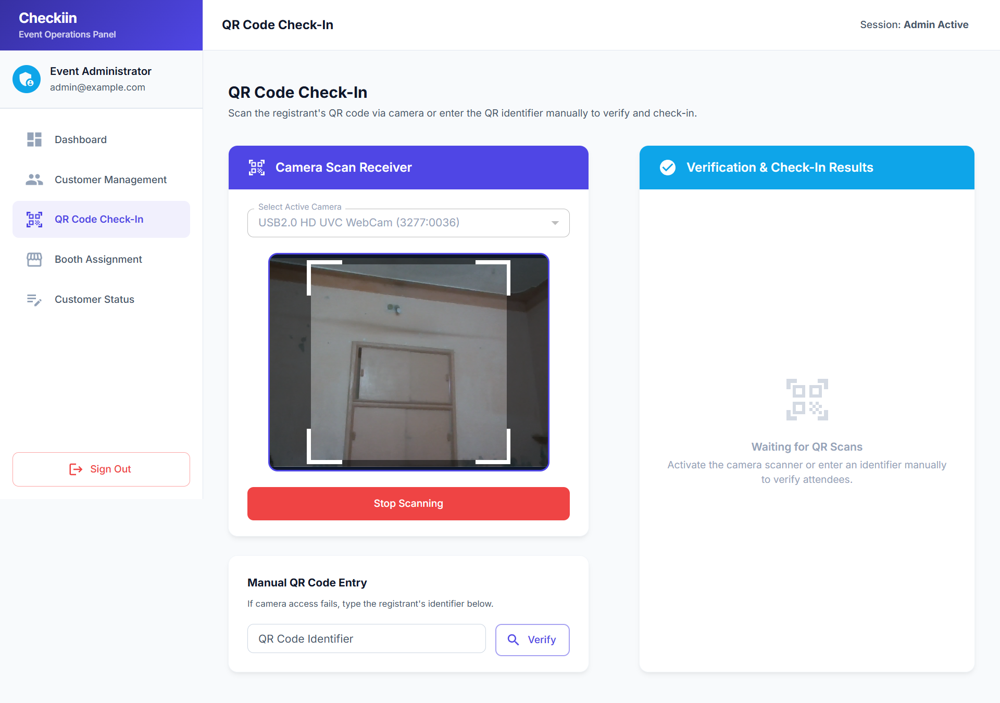
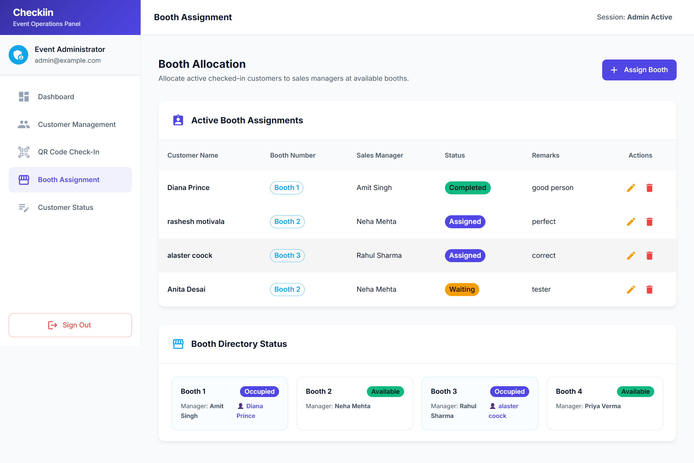
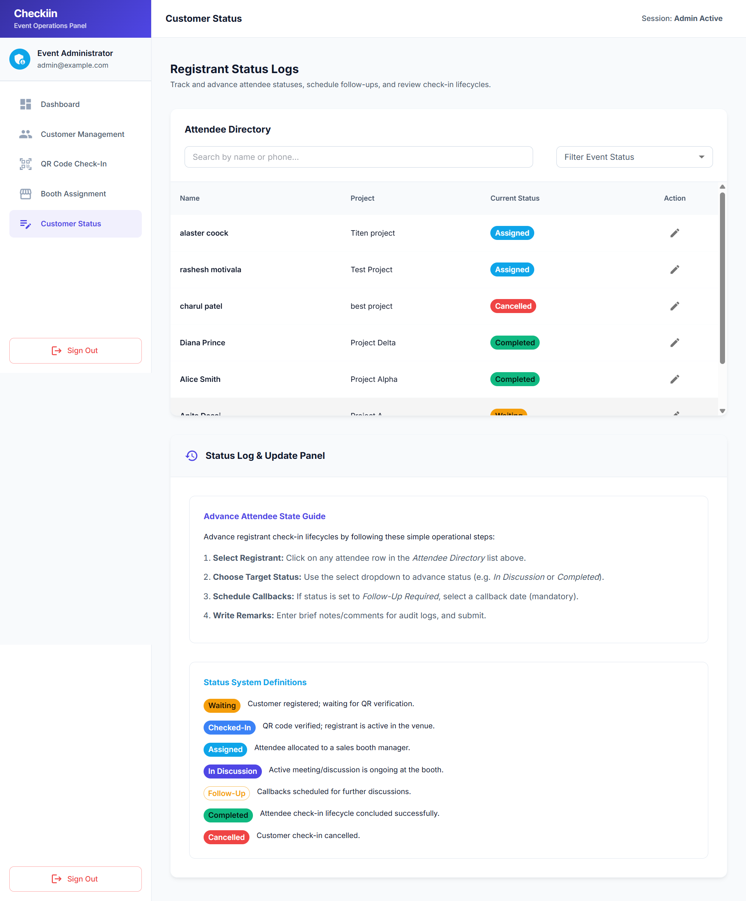

# Event Customer Check-In Dashboard

## Project Overview

This is a ReactJS web application developed for managing event customer check-ins. The application allows event staff to verify customers using QR codes, assign booths, update customer status, and monitor event progress through a dashboard.

### Features

- User authentication with JWT
- Dashboard with summary cards and status chart
- Customer CRUD operations
- Search and filter customers
- QR code verification and check-in
- Booth assignment management
- Customer status updates with history
- Responsive UI
- Protected routes

---

## Setup Instructions

### 1. Clone the repository

```bash
git clone https://github.com/rasheshdarji1509/checkin-dashboard-frontend.git
```

### 2. Navigate to the project

```bash
cd checkin-dashboard-frontend
```

### 3. Install dependencies

```bash
npm install
```

### 4. Create a `.env` file

```env
VITE_API_URL=https://your-backend-url.onrender.com/api
```

Replace the URL with your deployed backend URL.

### 5. Start the development server

```bash
npm run dev
```

To test the production build:

```bash
npm run build
npm run preview
```

---

## Login Credentials

Use the following credentials to access the application.

**Email** - admin@example.com

**Password** - admin123


## API Details

### Authentication

- POST `/api/login`

### Dashboard

- GET `/api/dashboard-summary`

### Customers

- GET `/api/customers`
- POST `/api/customers`
- GET `/api/customers/:id`
- PUT `/api/customers/:id`
- DELETE `/api/customers/:id`

### QR Code

- GET `/api/qr-codes/verify/:qrCode`
- POST `/api/customers/check-in`

### Booth Assignment

- GET `/api/booth-assignments`
- POST `/api/booth-assignments`
- PUT `/api/booth-assignments/:id`
- DELETE `/api/booth-assignments/:id`

### Customer Status

- GET `/api/customer-status/:customerId`
- POST `/api/customer-status`

---

## Third-Party Libraries Used

| Library | Purpose |
|----------|---------|
| Material UI | UI Components |
| Redux Toolkit | State Management |
| React Router DOM | Routing |
| Axios | API Requests |
| React Hook Form | Form Handling & Validation |
| React Toastify | Toast Notifications |
| Recharts | Dashboard Charts |
| html5-qrcode | QR Code Scanner |
| Vitest | Unit Testing |

---

## Screenshots

### Login



---

### Dashboard



---

### Customer List



---

### QR Scanner



---

### Booth Assignment



---

### Customer Status

